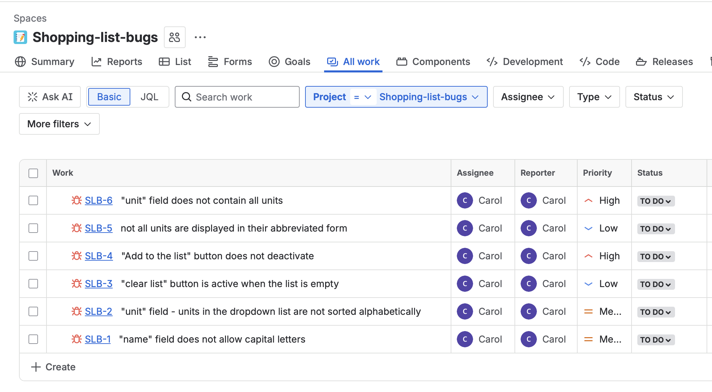

# Shopping List App

## Bugs reported in Jira

| Name    | Screenshot |
| :------- | :------- |
| "name" field does not allow capital letters  | [SLB-1](SLB-1.png)    |
| "unit" field - unit in the dropdown list are not sorted alphabetically | [SLB-2](SLB-2.png)     |
| "clear list" button is active when the list is empty    | [SLB-3](SLB-3.png)    |
| "Add to the list" button does not deactivate | [SLB-4](SLB-4.png) |
| not all units are displayed in their abbreviated form | [SLB-5](SLB-5.png) |
| "unit" field does not contain all units | [SLB-6.1](SLB-6.1.png), [SLB-6.2](SLB-6.2.png) |

