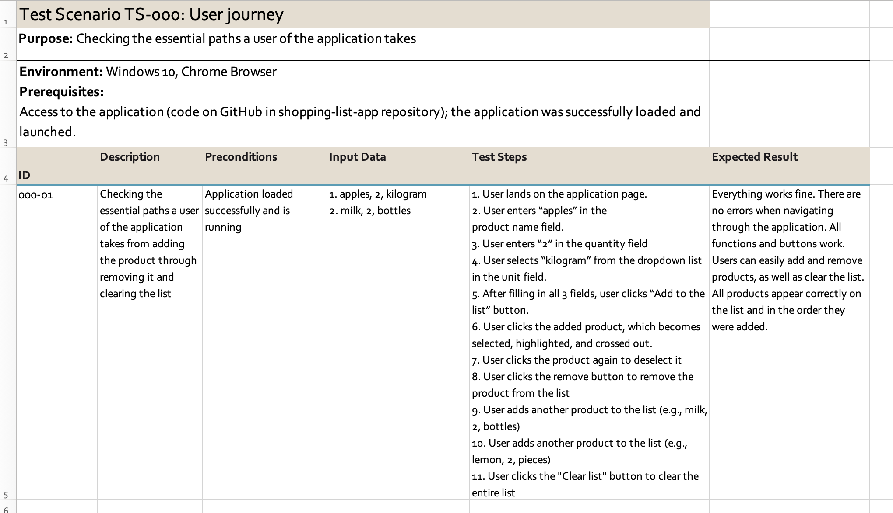
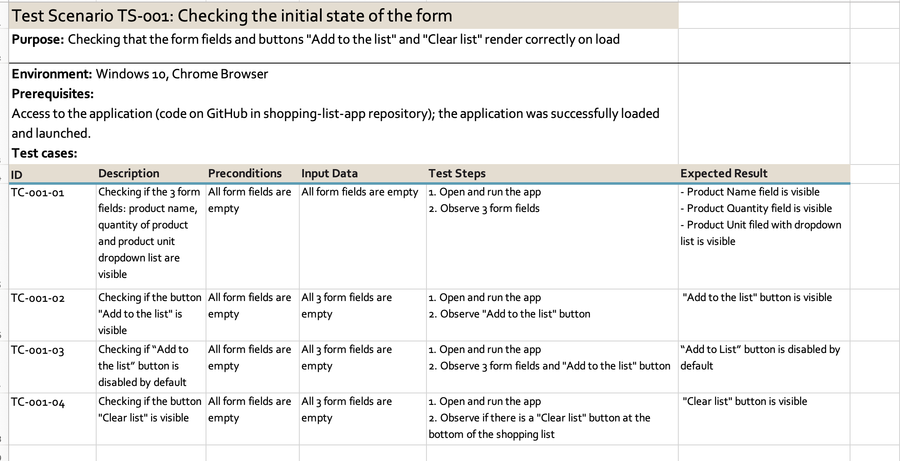
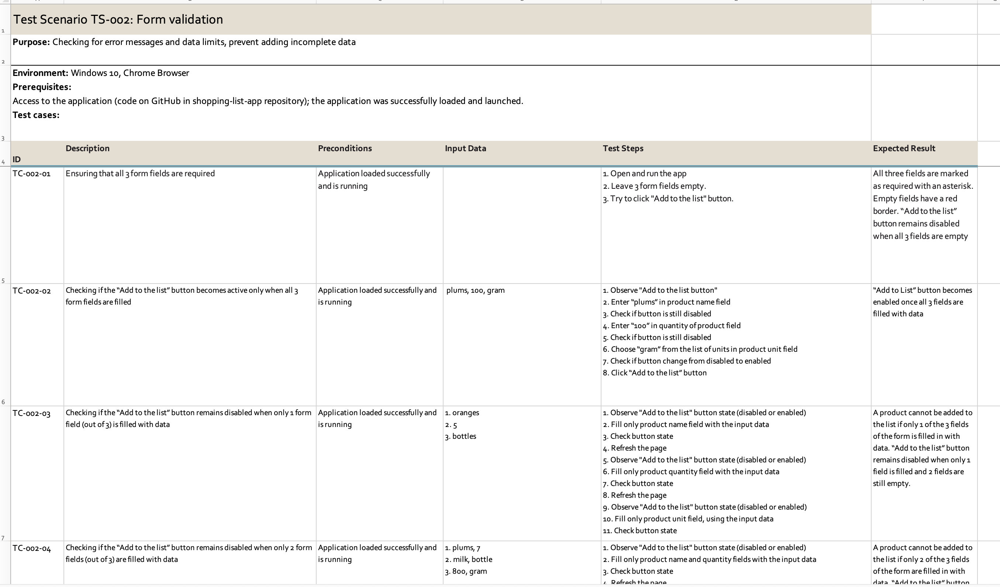
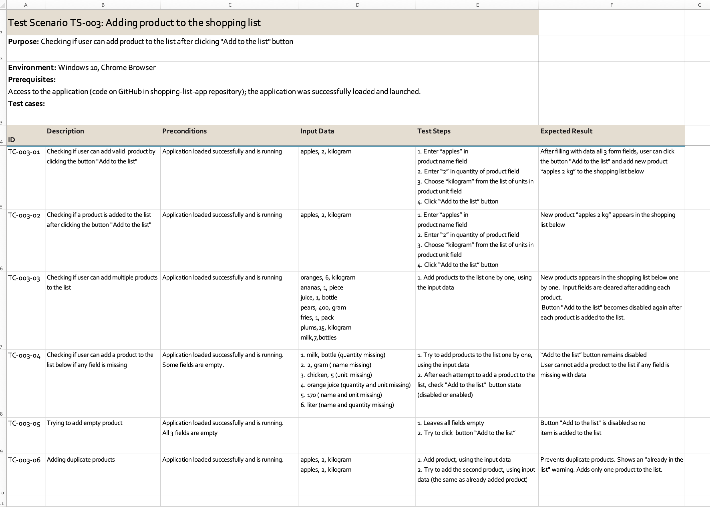
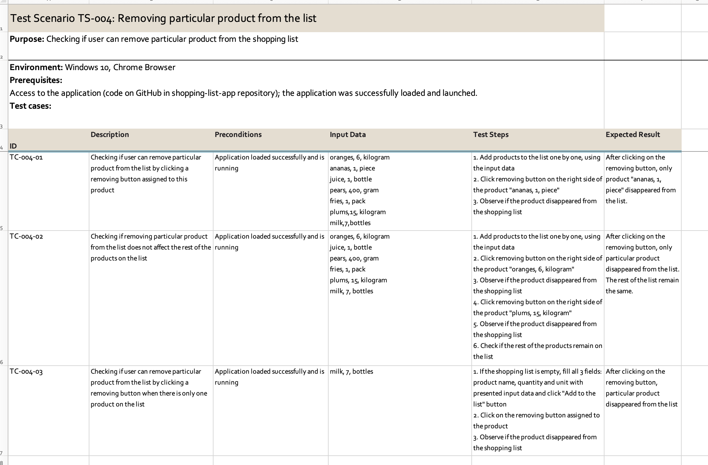
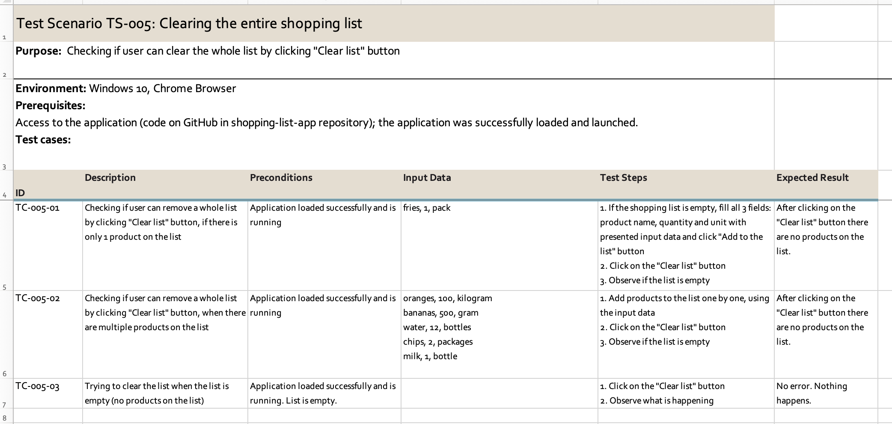
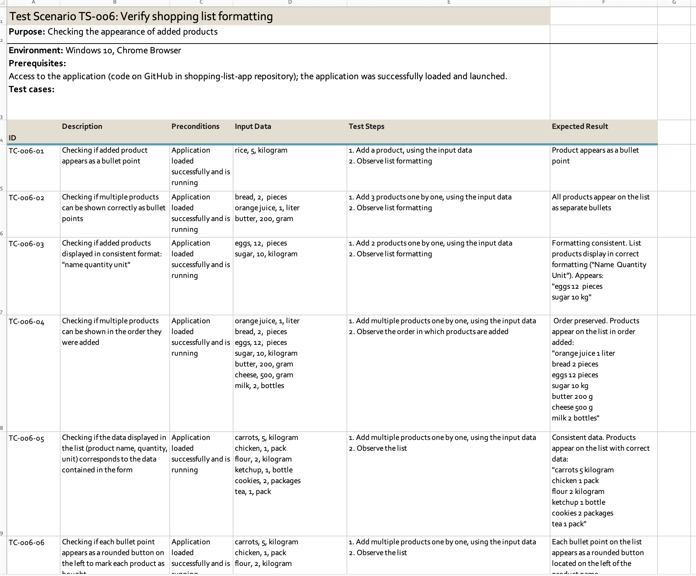
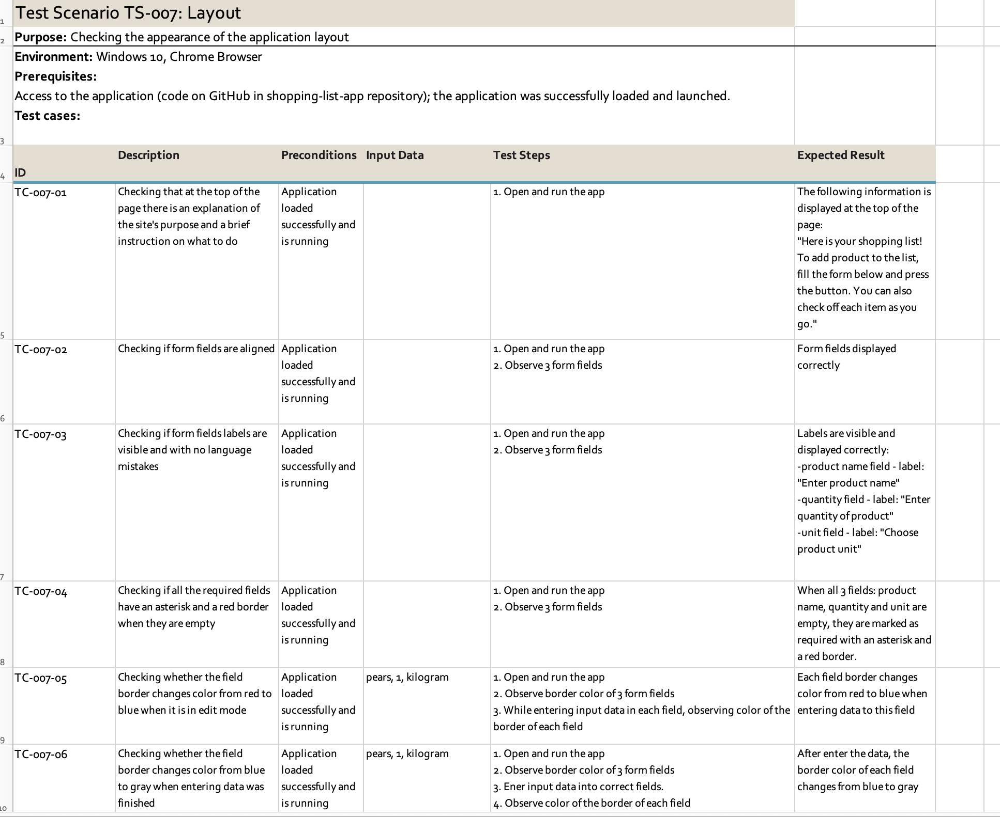

# Shopping List App

## Test Cases and Scenarios

Test cases and scenarios created in Excel for testing my "shopping list app".

### Description

- <a href="https://github.com/just-caarol/test-documentation/raw/refs/heads/master/shopping-list-app/test-scenarios-cases/shopping-list-test-scenarios-cases.xlsx">`shopping-list-test-scenarios-cases.xlsx`</a> - excel file with test scenarios and cases

### Screenshots of test scenarios and cases

    
      
    
    
    
    
    
    

